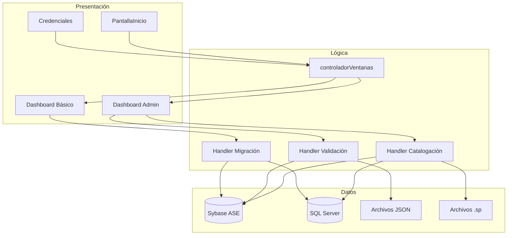
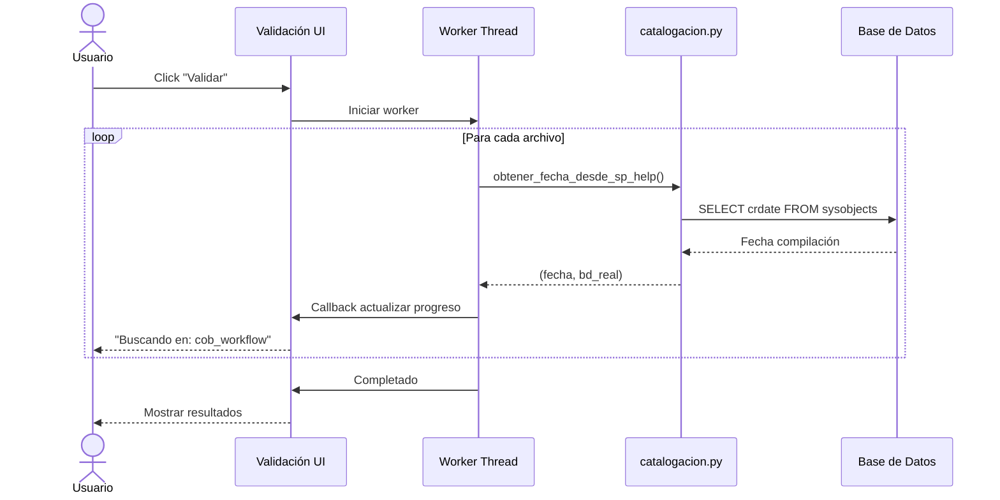
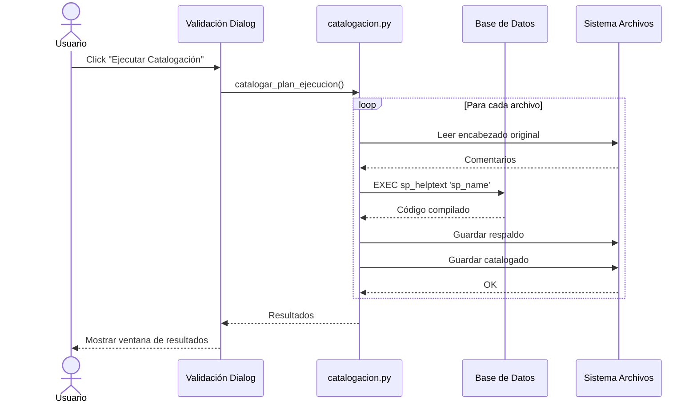
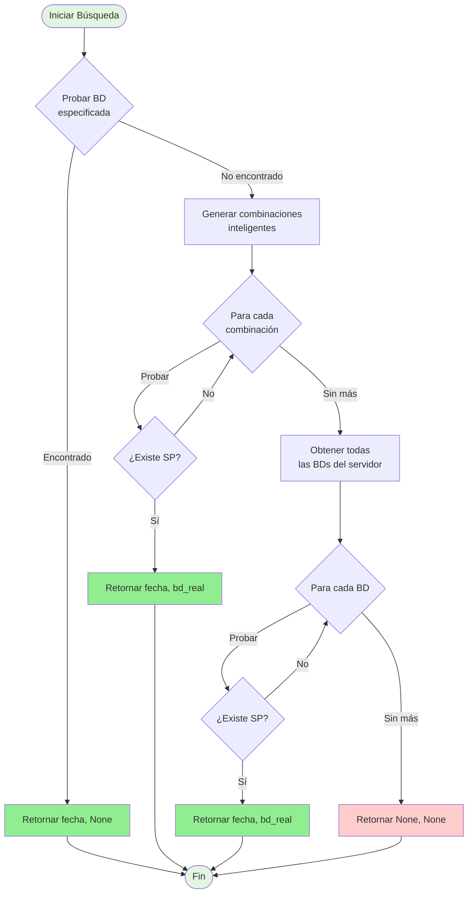
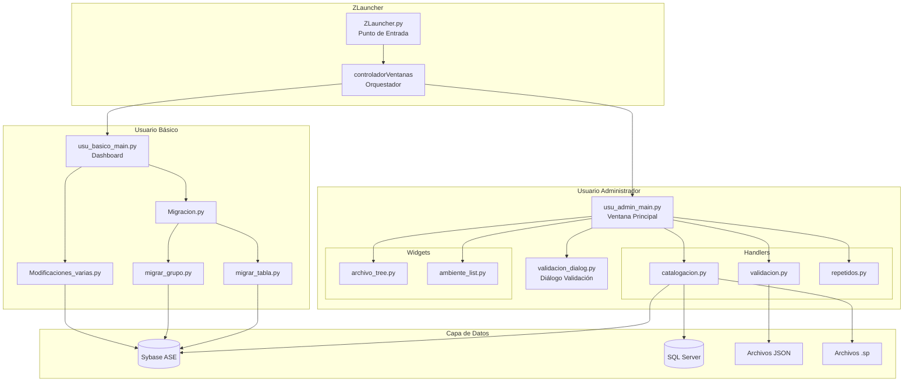
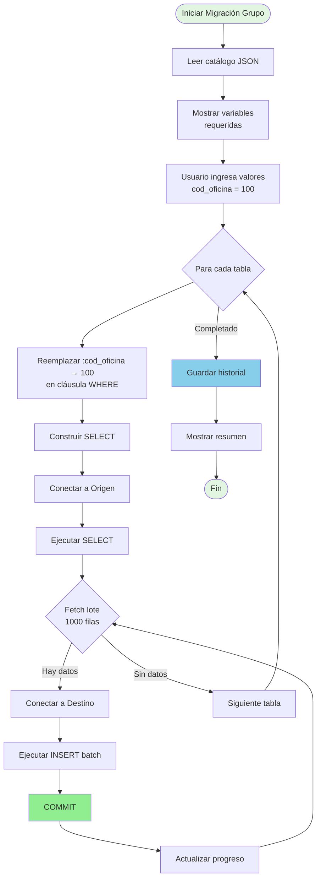
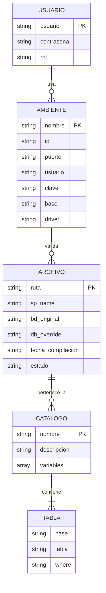
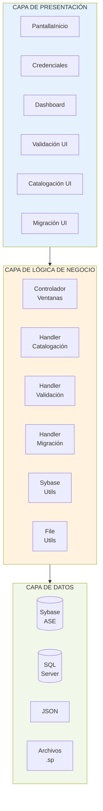
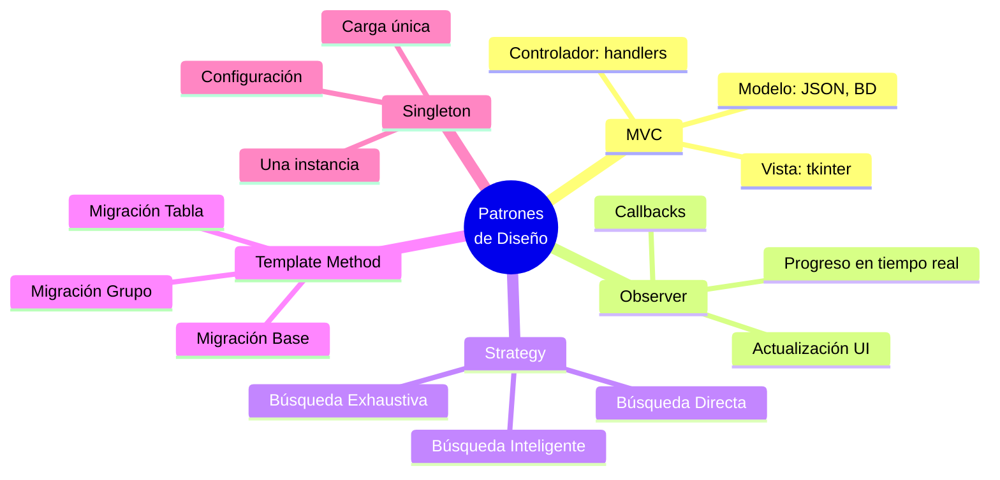

# Diagramas del Sistema ZetaOne

Este archivo contiene diagramas en formato Mermaid que pueden ser renderizados como imágenes.

## Cómo Convertir a Imágenes

### Opción 1: Mermaid Live Editor (Online)
1. Visita: https://mermaid.live/
2. Copia el código del diagrama
3. Pégalo en el editor
4. Click en "PNG" o "SVG" para descargar

### Opción 2: VS Code
1. Instala extensión: "Markdown Preview Mermaid Support"
2. Abre este archivo en VS Code
3. Click derecho en el diagrama → "Copy Mermaid Diagram as PNG"

### Opción 3: CLI (Requiere Node.js)
```bash
npm install -g @mermaid-js/mermaid-cli
mmdc -i diagrama.mmd -o diagrama.png
```

---

## 1. Arquitectura de Alto Nivel



**Guardar como:** `imagenes/arquitectura_alto_nivel.png`

---

## 2. Flujo de Validación



**Guardar como:** `imagenes/flujo_validacion.png`

---

## 3. Flujo de Catalogación



**Guardar como:** `imagenes/flujo_catalogacion.png`

---

## 4. Algoritmo de Búsqueda Inteligente



**Guardar como:** `imagenes/algoritmo_busqueda_inteligente.png`

---

## 5. Componentes del Sistema



**Guardar como:** `imagenes/componentes_sistema.png`

---

## 6. Flujo de Migración de Grupo



**Guardar como:** `imagenes/flujo_migracion_grupo.png`

---

## 7. Modelo de Datos (Entidades)



**Guardar como:** `imagenes/modelo_datos.png`

---

## 8. Arquitectura de 3 Capas



**Guardar como:** `imagenes/arquitectura_3_capas.png`

---

## 9. Patrones de Diseño Utilizados



**Guardar como:** `imagenes/patrones_diseno.png`

---

## Uso en la Documentación

Reemplace los placeholders `[IMAGEN: descripción]` con:

```markdown


```
